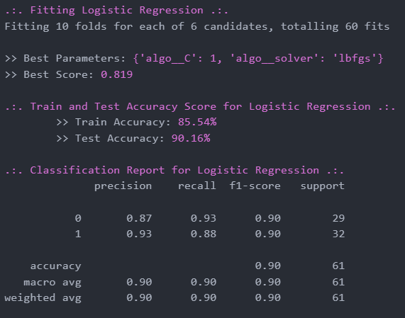
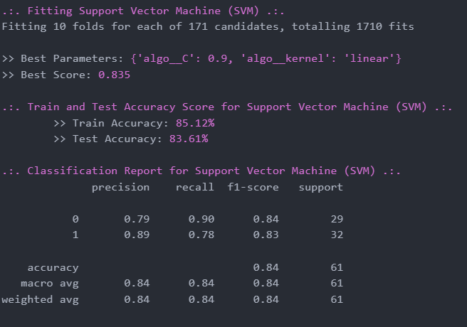
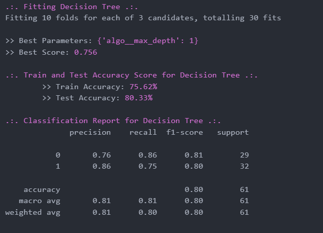
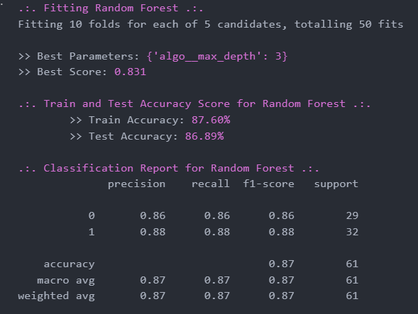
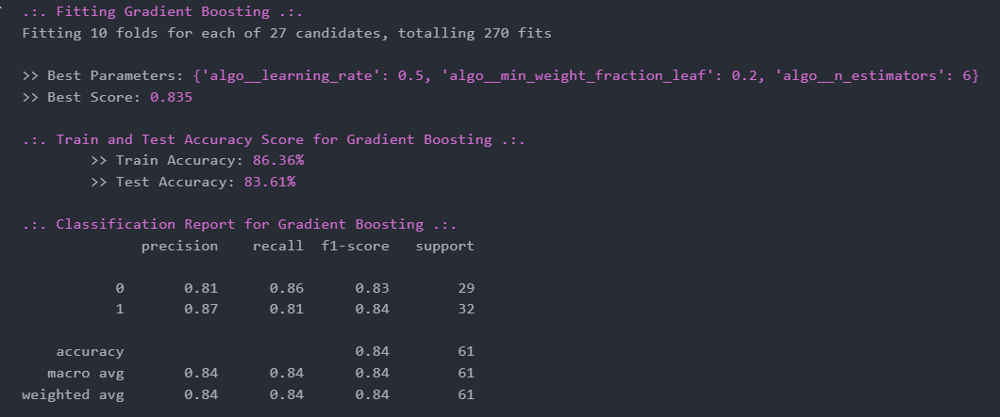
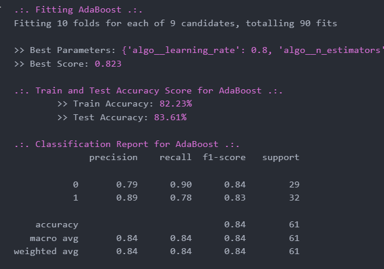
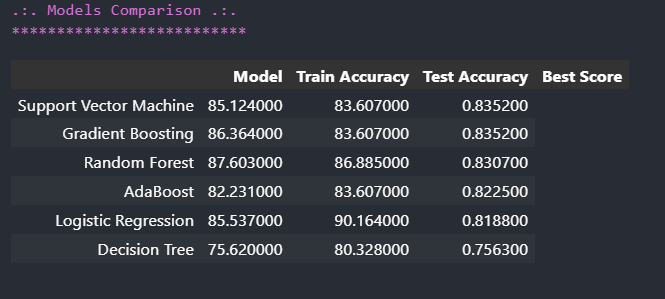
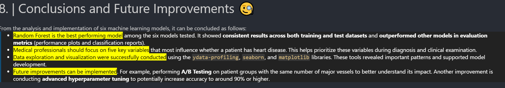

# Heart Disease Prediction using Machine Learning

## Overview

Cardiovascular disease remains one of the leading causes of mortality worldwide. Early prediction using machine learning techniques can significantly improve diagnostic accuracy and support clinical decision-making.

This project implements a complete machine learning pipeline for predicting heart disease using structured clinical datasets.

The pipeline includes:

- Data preprocessing
- Exploratory Data Analysis (EDA)
- Feature engineering
- Model training
- Model comparison
- Hyperparameter tuning
- Model evaluation and visualization

Multiple supervised learning algorithms were implemented and evaluated to identify the best-performing predictive model.

---

## Dataset Features

The dataset includes clinical parameters such as:

- Age
- Sex
- Chest pain type
- Resting blood pressure
- Cholesterol level
- Fasting blood sugar
- Resting ECG results
- Maximum heart rate
- Exercise induced angina
- ST depression
- Slope of peak exercise ST segment
- Number of major vessels
- Thalassemia type

These features are commonly used indicators in cardiovascular disease prediction systems.

---

## Machine Learning Models Used

The following classifiers were implemented:

- Logistic Regression
- Random Forest Classifier
- Support Vector Machine (SVM)
- Decision Tree
- Gradient Boosting
- AdaBoost

Model performance was evaluated using:

- Accuracy Score
- Confusion Matrix
- ROC Curve
- Precision-Recall Curve
- Feature Importance Analysis

---

## Exploratory Data Analysis

EDA steps included:

- Missing value inspection
- Feature distribution visualization
- Correlation heatmaps
- Outlier detection
- Statistical plots
- QQ-plots
- Class balance inspection

Visualization libraries used:

- Seaborn
- Matplotlib
- Yellowbrick
- PyWaffle

---

## Model Evaluation Metrics

Evaluation metrics used:

- Accuracy
- Precision
- Recall
- F1-score
- ROC-AUC Score

These metrics help assess classification performance and clinical reliability.

---

## Tools and Libraries

The project was implemented using:

- Python
- Scikit-learn
- Pandas
- NumPy
- Matplotlib
- Seaborn
- Yellowbrick
- Statsmodels
- YData Profiling

---

## Project Workflow

1. Data loading
2. Data preprocessing
3. Feature encoding
4. Feature scaling
5. Train-test split
6. Model training
7. Model comparison
8. Hyperparameter tuning
9. Model evaluation
10. Visualization and interpretation

---

## Future Improvements

Future work may include:

- Deep learning implementation
- Feature selection optimization
- Cross-validation improvements
- Model deployment using Flask or Streamlit
- Integration with clinical decision-support systems

---

## Model Performance Visualization

The performance of multiple supervised machine learning classifiers was evaluated using Accuracy, Recall, Precision, and ROC-AUC metrics.

### Logistic Regression Performance

### Support Vector Machine (SVM) Performance

### Decision Tree Performance

### Random Forest Performance

### Gradient Boosting Performance

### AdaBoost Performance

---

## Model Comparison

The following figure illustrates the performance comparison between all implemented classifiers based on evaluation metrics such as Accuracy and Recall.

---

## Best Performing Model

Based on evaluation metrics such as Accuracy, Recall, and ROC-AUC score, the best-performing classifier in this project is:

**Random Forest Classifier**

The following figure highlights the performance of the best model:

---

## Author

Tasneem
Machine Learning & Computer Vision Student
